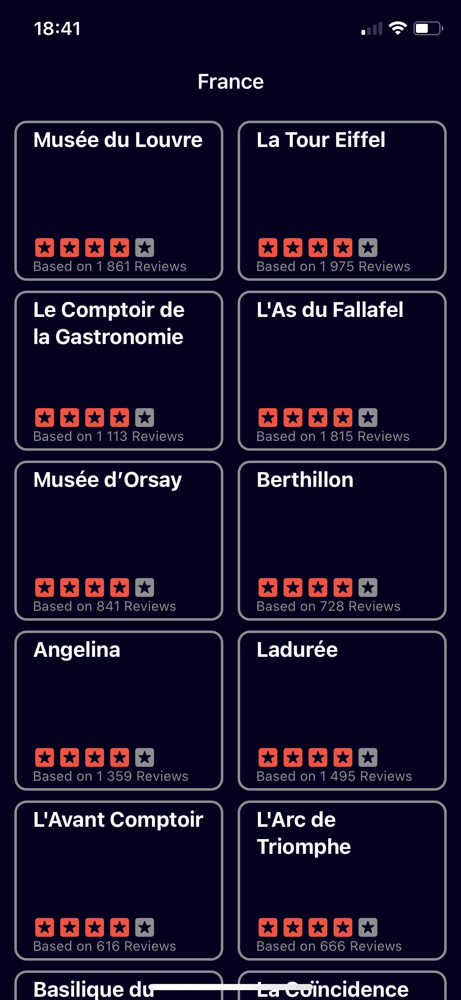
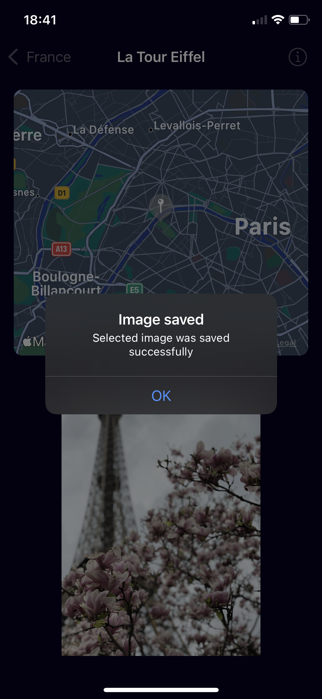
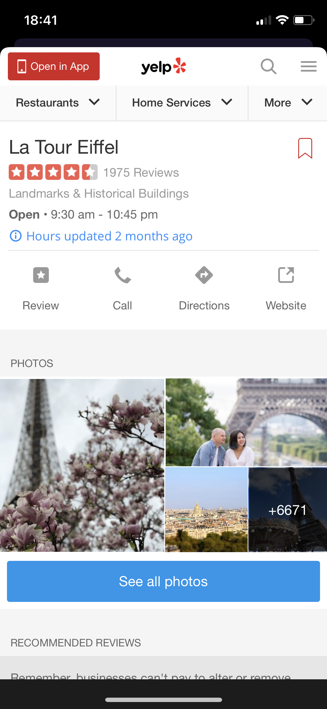

# iOS-YelpGraphQL
iOS app - YelpGraphQL. Created using SwiftUI.

<table>
  <tr>
  <td></td>
  <td></td>
  <td></td>
  </tr>
 </table>

Using Yelp GraphQL API to fetch 20 best matched business places. Displaying results in two-column vertical Grid. Each item can be tapped on to open further View containg Map of given place and asynchronously fetched photo tied with place (photo can be saved to Gallery by tapping on). View also contain possibility to showcase Sheet containing Yelp webcontent of selected place.

Target: iOS14
Stack: SwiftUI, Async/Await networking (URLSession for image fetch), Apollo (GraphQL), WebKit (UIViewRepresentable for WKWebView)
Please update UserManagementInterceptor Struct (found in GraphQL/Apollo.swift) with your bearer token for accessing Yelp API.
